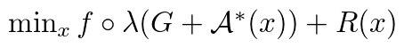

# PFOpt

PFOpt is a MATLAB toolbox for solving large-scale low-rank optimization
problems using polynomial-filtered subspace extraction. 
## Problems and Solvers
PFOpt can be plugged into any optimization solver in which 
eigenvalue decompositions are required. We provide two example solvers
PFPG (polynomial-filtered proximal gradient), and PFGAUGE (polynomial-filtered
GAUGE) in the package.

### PFPG
PFPG is used for solving



Evaluating `f(x)` and the gradient of `f(x)` only requires part of the
eigenvalues and eigenvectors.

### PFGAUGE
PFGAUGE is modified based on the solver GAUGE (by MP Friedlander). The solver
is designed for the maximal eigenvalue problem:


This code uses the [GAUGE software package](https://www.cs.ubc.ca/~mpf/pubs/low-rank-spectral-optimization-via-gauge-duality/) described here:
- Low-rank spectral optimization via gauge duality. M. P. Friedlander and I. Macêdo. SIAM J. on Scientific Computing, 38(3):A1616-A1638, 2016

## Installation

First download the source code and unzip anywhere you like.

Then launch MATLAB and run
```
>> cd PFOpt
>> pf_setup
```
You are ready to go!

Feel free to run the examples under the `examples` folder. Please read the
instructions in the corresponding folders, see `README.md`.
- `simple`: simple test routines, see `test_pf.m`.
- `ncm`: nearest correlation matrix problems, see `test_synthetic.m`
and `test_real.m`.
- `maxeig`: maximal eigenvalue problems, see `test_phaselift.m`.

## How to Apply PFOpt to Your Own Solver
If your own solver contains eigenvalue decompositions, you can simply plug
PFOpt into your codes by following just two steps:
1. At the beginning of your solver, initialize a workspace for PFOpt.
   ```
   work = struct();
   work.degree = 8;
   work.k = -1;
   ```
   Parameters can be set according to `eig_inexact.m` optionally.
2. Replace all your `eig` or `eigs` calls with
   ```
   [U, d, work] = eig_inexact(A, work);
   ```
   or
   ```
   [U, d, work] = eig_inexact(A, work, n);
   ```
   if A is a function handle. Note that the workspace `work` should be passed
   through all `eig_inexact` calls. Probably you have to make `work` as one
   extra parameter if `eig` or `eigs` also appear in one or more subroutines.

Currently PFOpt is able to extract all positive eigenvalues or k largest
eigenvalues of a given matrix A. If all negative or k smallest eigenvalues
are needed, change A into -A.

## References
- [Yongfeng Li, Haoyang Liu, Zaiwen Wen, and Yaxiang Yuan. Low-rank Matrix Optimization Using Polynomial-filtered Subspace Extraction.](https://arxiv.org/pdf/1904.10585.pdf)
- [Friedlander M. P. and Macêdo, I. Low-rank Spectral Optimization via Gauge Duality. SIAM Journal on Scientific Computing (2016): A1616-A1638.](https://doi.org/10.1137/15M1034283)
- [Lanhui Wang, Amit Singeer, and Zaiwen Wen. Orientation Determination of Cryo-EM Images Using Least Unsquared Deviations. SIAM Journal on Imaging Sciences (2013): 2450-2483.](https://epubs.siam.org/doi/abs/10.1137/130916436)
- [Zaiwen Wen and Yin Zhang. Accelerating Convergence by Augmented Rayleigh--Ritz Projections For Large-Scale Eigenpair Computation. SIAM Journal on Matrix Analysis and Applications (2017): 273-296.](https://epubs.siam.org/doi/abs/10.1137/16M1058534)

## The authors
We hope that the package is useful for your applications. Please feel free
to contact the authors if you have any comments or bug reports.

- Haoyang Liu (liuhaoyang@pku.edu.cn)
- Zaiwen Wen  (wenzw@pku.edu.cn)

## Copyright
PFOpt

Copyright (C) 2019  Haoyang Liu (liuhaoyang@pku.edu.cn)
                    Zaiwen Wen  (wenzw@pku.edu.cn)

This program is free software: you can redistribute it and/or modify
it under the terms of the GNU General Public License as published by
the Free Software Foundation, either version 3 of the License, or
(at your option) any later version.

This program is distributed in the hope that it will be useful,
but WITHOUT ANY WARRANTY; without even the implied warranty of
MERCHANTABILITY or FITNESS FOR A PARTICULAR PURPOSE.  See the
GNU General Public License for more details.

You should have received a copy of the GNU General Public License
along with this program.  If not, see <http://www.gnu.org/licenses/>.
